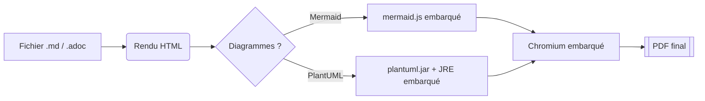
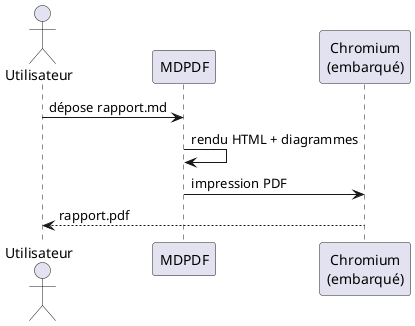

# Rapport d'exemple Markdown

Ce document illustre les capacités du convertisseur **MDPDF** : titres,
sommaire automatique, code coloré, tableaux, diagrammes et notes.

## Mise en forme de base

Du texte en **gras**, en *italique*, du ~~barré~~, du `code inline` et un
[lien externe](https://example.com) (les liens restent cliquables dans le PDF).

> Une citation pour montrer le rendu des blocs de citation.
> Elle peut s'étendre sur plusieurs lignes.

### Listes

- Un élément
- Un autre élément
  - Sous-élément imbriqué
- [x] Tâche terminée
- [ ] Tâche à faire

## Code source coloré

```python
from dataclasses import dataclass

@dataclass
class Document:
    """Un document à convertir."""
    titre: str
    pages: int = 0

    def resume(self) -> str:
        return f"{self.titre} ({self.pages} pages)"
```

```sql
SELECT titre, COUNT(*) AS nb
FROM documents
WHERE format IN ('md', 'adoc')
GROUP BY titre;
```

## Tableau

| Fonctionnalité        | Markdown | AsciiDoc |
|-----------------------|:--------:|:--------:|
| Sommaire automatique  |    ✔     |    ✔     |
| Coloration syntaxique |    ✔     |    ✔     |
| Diagrammes Mermaid    |    ✔     |    ✔     |
| Diagrammes PlantUML   |    ✔     |    ✔     |

## Diagramme Mermaid



## Diagramme PlantUML



## Note de bas de page

Le convertisseur fonctionne entièrement hors-ligne[^1].

[^1]: Aucune requête réseau n'est émise à l'exécution : toutes les
      ressources (Chromium, mermaid.js, plantuml.jar, JRE) sont embarquées.
